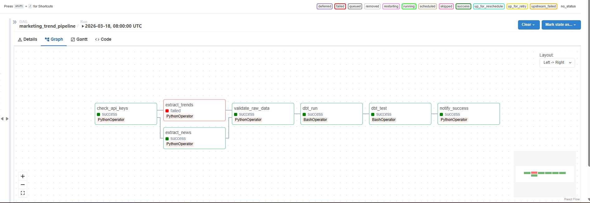
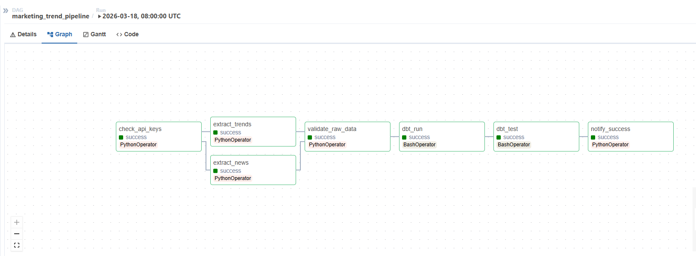

# Marketing Trend Intelligence Pipeline

A data pipeline that tracks marketing keyword trends and compares them with news coverage.  
Its purpose is to help identify topics with high audience interest but low media coverage.

## Tools

- Python
- Google Trends API (Pytrends)
- NewsAPI
- PostgreSQL
- dbt
- Apache Airflow
- Docker Compose
- Metabase

## How it is used

The pipeline is orchestrated by **Apache Airflow** and runs automatically on a daily schedule.

For the marketing team, usage is simple:
- Open the **Metabase dashboard**
- Review keyword trends and related news coverage
- Detect topics with high search interest and low article volume
- Use these insights to identify content opportunities
- Add or remove tracked keywords for future pipeline runs

The marketing team mainly interacts with the dashboard, while Airflow handles the automated execution of the pipeline in the background.

## Dashboard

## Architecture

