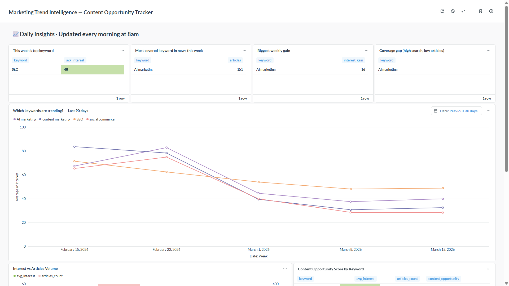
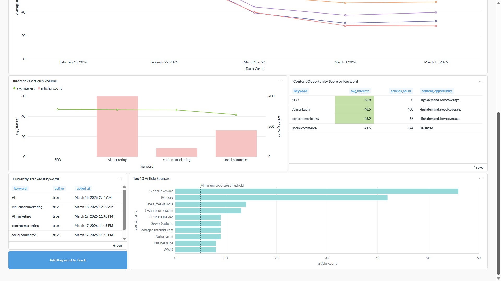

# 📊 Marketing Trend Intelligence — Content Opportunity Tracker

> A production-grade data engineering pipeline that automatically tracks marketing keyword trends and correlates them with news coverage — rebuilt daily and visualized in a self-service dashboard.




---

## 🎯 What it does

Every morning at 8am, this pipeline automatically:
1. Pulls keyword search interest from **Google Trends**
2. Pulls related news articles from **NewsAPI**
3. Transforms raw data into a **star schema** using dbt
4. Updates a **Metabase dashboard** with fresh insights

The marketing team opens their browser and immediately sees:
- Which keywords are trending up or down
- Which topics are covered by media vs underserved
- Where the **content opportunity gap** is — high demand, low coverage

No manual work. No spreadsheets. No waiting.

---

## 🏗️ Architecture

```
Google Trends API          NewsAPI
      ↓                       ↓
extract_trends.py      extract_news.py
      ↓                       ↓
  raw_trends             raw_articles        ← PostgreSQL landing tables
          ↓             ↓
          dbt transform
          ↓             ↓
     fact_trends    fact_articles            ← Star schema marts
     dim_date       stg_trends
                    stg_articles
                          ↓
                      Metabase
               (dashboard + keyword management)
                          ↓
              Apache Airflow (daily at 8am UTC)
              orchestrates the full pipeline
```

---

## 🛠️ Tech Stack

| Layer | Tool | Purpose |
|---|---|---|
| Extract | Python (Pytrends, NewsAPI) | Pull data from APIs |
| Transform | dbt 1.7 | Staging → star schema |
| Load | PostgreSQL 15 | Data warehouse |
| Orchestrate | Apache Airflow 2.8 | Daily scheduling + retries |
| Containerize | Docker + Docker Compose | Reproducible environment |
| Report | Metabase | Self-service dashboard |
| Version Control | GitHub | Portfolio + collaboration |

---

## ✨ Features

- **Automated daily pipeline** — Airflow DAG runs every morning at 8am UTC with 3 retries on failure
- **Star schema data model** — `fact_trends`, `fact_articles`, `dim_date` built with dbt
- **Self-service keyword management** — marketing team adds/removes keywords via Metabase dashboard without touching code
- **Data quality validation** — pipeline stops before dbt if no data was extracted, preventing stale model rebuilds
- **7 dbt tests** — not_null, unique constraints on every critical column
- **Idempotent extracts** — re-running never creates duplicate rows (`ON CONFLICT DO NOTHING`)
- **Graceful degradation** — if Google Trends rate-limits, pipeline continues with NewsAPI data and logs a warning instead of failing completely
- **Content opportunity scoring** — CASE logic classifies each keyword as "High demand, low coverage", "Balanced", etc.
- **Separated concerns** — each service runs in its own Docker container (Postgres, Airflow, dbt, Metabase)

---

## 📊 Dashboard

The **Marketing Trend Intelligence** dashboard includes:

| Card | What it shows |
|---|---|
| This week's top keyword | Highest average search interest |
| Most covered in news | Keyword with most articles this week |
| Biggest weekly gain | Keyword with largest interest increase |
| Coverage gap | High search demand, low article coverage |
| Keyword trends (line chart) | Weekly interest per keyword — last 90 days |
| Interest vs Articles Volume | Dual-axis: search score vs article count |
| Content Opportunity Score | Table with opportunity classification per keyword |
| Top 10 Article Sources | Most active publishers covering your keywords |
| Currently Tracked Keywords | Live view of active keywords |
| Add Keyword to Track | One-click form to add new keywords |

---

## 📁 Project Structure

```
marketing-trend-pipeline/
├── dags/
│   └── marketing_pipeline_dag.py    # Airflow DAG — 6 tasks
├── extract/
│   ├── extract_trends.py            # Google Trends extractor
│   ├── extract_news.py              # NewsAPI extractor
│   ├── manage_keywords.py           # CLI keyword management
│   └── requirements.txt
├── transform/
│   └── marketing_transform/
│       ├── models/
│       │   ├── staging/
│       │   │   ├── stg_trends.sql
│       │   │   ├── stg_articles.sql
│       │   │   ├── stg_keywords.sql
│       │   │   ├── sources.yml
│       │   │   └── schema.yml
│       │   └── marts/
│       │       ├── fact_trends.sql
│       │       ├── fact_articles.sql
│       │       └── dim_date.sql
│       ├── dbt_project.yml
│       └── profiles.yml
├── sql/
│   └── init.sql                     # Schema + seed data
├── docs/
│   ├── c9.png                       # Dashboard screenshot (top)
│   └── c10.png                      # Dashboard screenshot (bottom)
├── Dockerfile                       # Airflow + dbt + extract deps
├── docker-compose.yml               # All 5 services
├── .env.example                     # Environment template
├── .gitignore
└── README.md
```

---

## 🗃️ Data Model

```
raw_trends ──→ stg_trends ──→ fact_trends ──┐
                                             ├──→ dim_date
raw_articles → stg_articles → fact_articles─┘

tracked_keywords → stg_keywords
```

**fact_trends** — one row per keyword per date (interest score 0-100)
**fact_articles** — one row per article (title, source, published date, URL)
**dim_date** — date dimension (year, month, week, day name)

---

## 🚀 Quick Start

### Prerequisites
- Docker Desktop with WSL 2 integration enabled
- NewsAPI free key from [newsapi.org](https://newsapi.org)
- Python 3.8+

### Setup

```bash
# 1 — Clone the repo
git clone https://github.com/zayneb-n/marketing_trend_pipeline.git
cd marketing_trend_pipeline

# 2 — Create environment file
cp .env.example .env
# Edit .env with your credentials and NewsAPI key

# 3 — Start PostgreSQL
docker compose up -d postgres

# 4 — Create separate databases
docker exec -it pipeline_postgres psql -U pipeline_user -d marketing_pipeline \
  -c "CREATE DATABASE airflow_db;"
docker exec -it pipeline_postgres psql -U pipeline_user -d marketing_pipeline \
  -c "CREATE DATABASE metabase_db;"

# 5 — Initialize Airflow
docker compose up airflow-init

# 6 — Start all services
docker compose up -d airflow-webserver airflow-scheduler metabase dbt

# 7 — Run first extract
python3 extract/extract_trends.py
python3 extract/extract_news.py

# 8 — Run dbt models
docker exec -it pipeline_dbt dbt run
docker exec -it pipeline_dbt dbt test
```

### Access services

| Service | URL | Credentials |
|---|---|---|
| Airflow UI | http://localhost:8080 | admin / admin |
| Metabase | http://localhost:3000 | set on first visit |
| PostgreSQL | localhost:5432 | from your .env |
| dbt docs | http://localhost:8081 | — |

---

## 🔑 Keyword Management

### Via CLI
```bash
# List all tracked keywords
python3 extract/manage_keywords.py

# Add a keyword
python3 extract/manage_keywords.py add "influencer marketing"

# Deactivate a keyword
python3 extract/manage_keywords.py remove "SEO"
```

### Via Metabase Dashboard
Use the **"Add Keyword to Track"** button directly in the dashboard. No technical knowledge required. The pipeline picks up new keywords on the next daily run automatically.

---

## ⚙️ Airflow DAG

```
extract_trends ──┐
                 ├──→ validate_raw_data ──→ dbt_run ──→ dbt_test ──→ notify_success
extract_news   ──┘
```

- Extract tasks run **in parallel**
- `validate_raw_data` acts as a gate — stops pipeline if no data landed
- 3 retries with 5-minute delays on every task
- `notify_success` logs pipeline summary with row counts

---

## 🌍 Environment Variables

```bash
# PostgreSQL
POSTGRES_USER=pipeline_user
POSTGRES_PASSWORD=your_password
POSTGRES_DB=marketing_pipeline

# Airflow
AIRFLOW__CORE__FERNET_KEY=generate_with_python_fernet

# NewsAPI
NEWS_API_KEY=your_newsapi_key_here

# Keywords fallback
TREND_KEYWORDS=AI marketing,content marketing,SEO,social commerce
```

Generate Fernet key:
```bash
python3 -c "from cryptography.fernet import Fernet; print(Fernet.generate_key().decode())"
```

---

## 👩‍💻 Author

**Zeineb Nouiri** — Data Engineer & Business Analytics

- Built with: Python · dbt · PostgreSQL · Airflow · Docker · Metabase
- Domain: Marketing Intelligence · Content Strategy · Digital Analytics